# Grocery List Planning

>A customer has entered an order, a picker picks out the associated items. The picker will register ad hoc information, communicate with the customer and transport the items to a holding area. 

# User Interface



The customer name field and the customer contact field are not editable. while the quantity picked and picking issue will have editable input boxes. The information shown here will be displayed in a **ListView**, using the *EditItemTemplate* as the part that shows the details for a given order. This image is missing the save button as well. 

# Events and Interactions



-  - **Page_Load** event
    -  - Load the list of picker from BLL
        - **`List<Pickers>
  OrderProcessingController.ListPickers()`**
 -  - The input field for the order number
-  - **FetchOrder** click event
    - The fetch will populate the customer name and contact information. It will do this by <Customers> or the customer entity in the database
    -  - Load the ListView data
        - **`List<PickedOrder>
    OrderProcessingController.LoadOrders(orderid, pickerid)
    `**
        - The two parameters will come from the forum
-  - **SaveOrder** click event
    - Use a custom command name of "PickOrder" and handle in the ListView's `ItemCommand` event.
 ```csharp
void OrderProcessingController.PickOrder(int orderId, int pickerId List<PickedItem> items)
 ```
 
-  - the items in these inputs will be editable
-  - **EditCommand** click event 
    - Default EditCommand behaviour of the ListView

# DTOs / POCOs

### Commands
```csharp
public class PickedItem
{
    public int ProductId { get; set; }
    public int QtyPicked { get; set; }
    public string PickingIssue { get; set; }
}
```

### Queries

```csharp
  public class Pickers
{
    public int PickerId {get; set;}
    public string FirstName {get; set;}
    public string LastName {get; set;}
}

  public class PickedOrder
{
    public string Description { get; set; }
    public int OrderedQty { get; set;}
    public string CustomerComment { get; set; }
    public int QtyPicked { get; set; }
    public string PickIssue { get; set; }
}

  public class Customers
{
    public int CustomerId {get; set;}
    public string FirstName {get; set;}
    public string LastName {get; set;}
}
```

# BLL Processing

All product shipments are handled by the OrderProcessingController. It supports the following methods.

- **`List<PickedOrder> LoadOrders(int pickerid, orderid)`**
    - Validation
        - Make sure its a valid picker
        - the clerk must enter a valid order number
        - the order must be completed by the right picker

- **`void ListPickers(int orderId, List<Pickers> pickers) `**
    - will display a list of the pickers from the database

- **`void PickOrder(int orderId, List<PickedOrder> orderItems) `**
    - Validation
        - OrderId must be valid
        - List<PickedItem> cannot be empty/null
        - Qty picked must be greater than 0 
        - Qty picked cannot be 0 if the picking issue is null 
        -